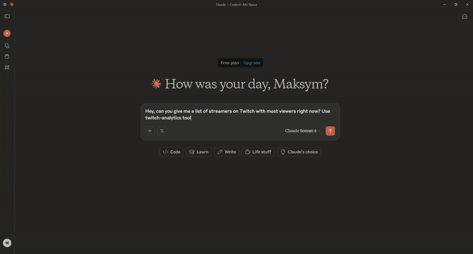

# Twitch Analytics MCP Server

A Model Context Protocol (MCP) server that provides comprehensive Twitch analytics through any MCP-compatible client. Analyze streamer performance, discover trending content, and get data-driven streaming insights using real Twitch API data.

## What is this?

This MCP server connects any MCP client to Twitch's API, giving you tools to:

- Analyze any streamer's performance and growth trends
- Find trending streamers and games in real-time
- Get optimal streaming time recommendations
- Compare streamers side-by-side
- Track game popularity over time

Instead of manually checking Twitch or using multiple analytics sites, just ask your MCP client questions like "How is pokimane performing this week?" or "What games are trending right now?"

<p align="center">
  
</p>

## Tech Stack

- **FastMCP** - MCP server framework
- **twitchAPI** - Python wrapper for Twitch Helix API
- **APSW** - SQLite database (cross-platform compatibility)
- **Pydantic** - Data validation and modeling

## How it works

```
MCP Client ←→ MCP Protocol ←→ FastMCP Server ←→ Twitch API
                                    ↓
                            SQLite Analytics Cache
```

The server runs in the background, collecting Twitch data every few minutes and caching it locally. When you query Twitch analytics through your MCP client, it uses the MCP tools to access this data and provide instant insights.

## MCP Client Compatibility

Works with any MCP-compatible client including:

- Claude Desktop
- Custom MCP implementations
- Third-party MCP clients
- Your own applications using MCP libraries

## Features (Planned)

**Phase 1 - Core Analytics**

- `discover_trending_streamers` - Find top live streamers
- `analyze_game_trends` - Current game popularity
- `analyze_streamer_performance` - Viewer stats and growth

**Phase 2 - Advanced Features**

- `optimal_streaming_times` - Best hours/days to stream
- `compare_streamers` - Side-by-side comparisons
- `analyze_my_follows` - Your following list analysis

And 9 more tools for comprehensive Twitch analytics.

## Setup

1. Get Twitch API credentials from [dev.twitch.tv](https://dev.twitch.tv/)
2. Install dependencies: `poetry install`
3. Configure environment variables in `.env`
4. Add server to your MCP client's configuration
5. Start querying Twitch data through your preferred MCP client!

## Configuration Examples

**Claude Desktop (mcp_settings.json):**

```json
{
  "mcpServers": {
    "twitch-analytics": {
      "command": "python",
      "args": ["-m", "twitch_analytics_mcp"]
    }
  }
}
```

**Custom MCP Client:**

```python
from mcp import ClientSession
# Connect to the Twitch MCP server
session = ClientSession("twitch-analytics")
```

## Why MCP?

Model Context Protocol provides a standardized way for AI systems and applications to access external tools and data sources. Instead of building custom integrations for each client, this server works with any MCP-compatible system, making Twitch analytics accessible through natural language queries across different platforms.
